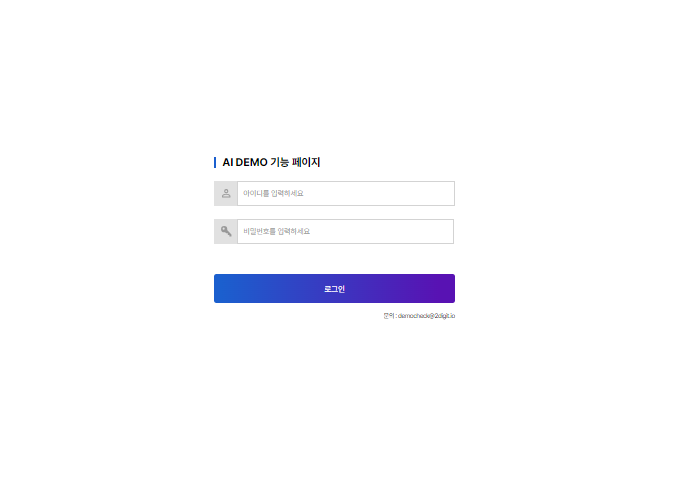
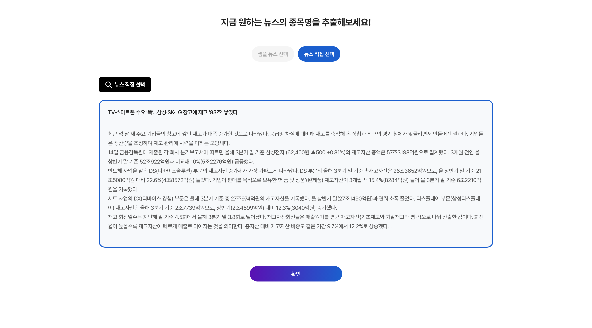
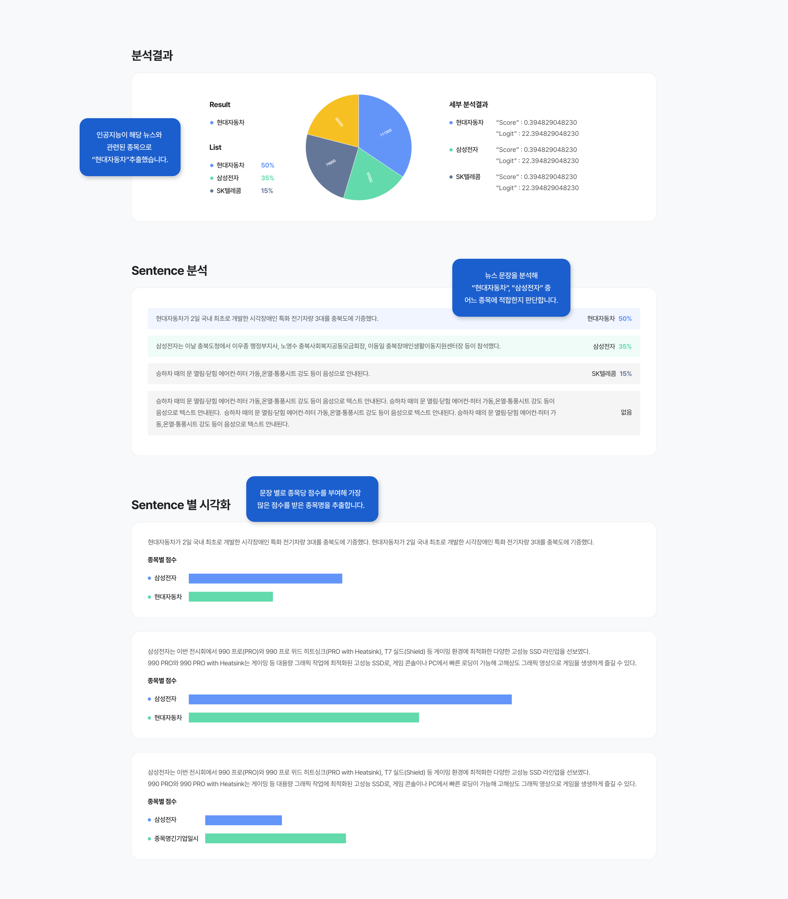
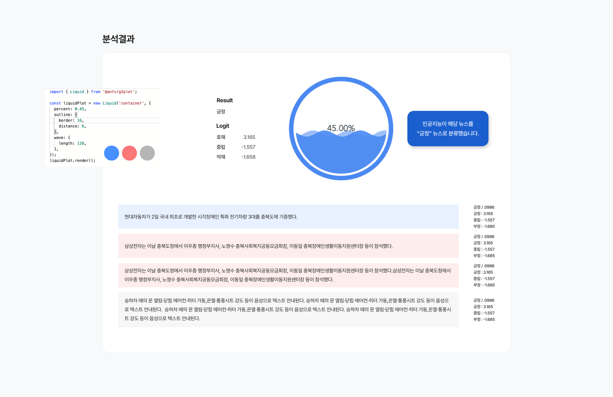
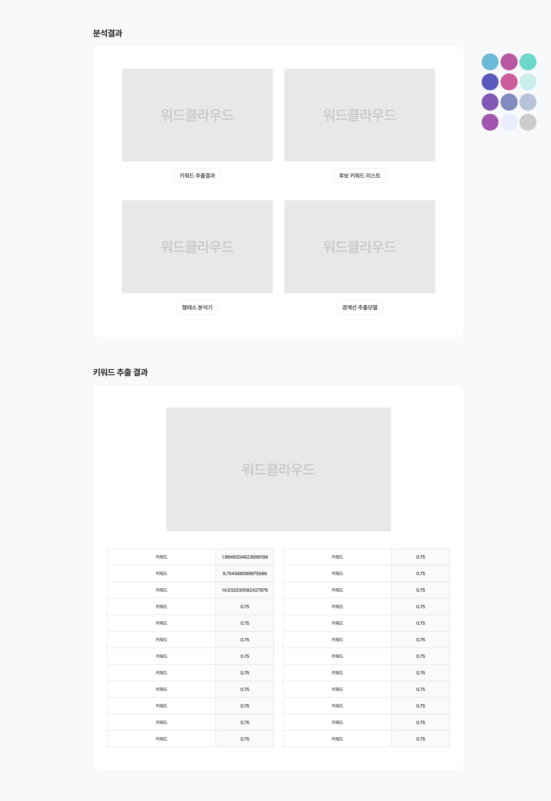
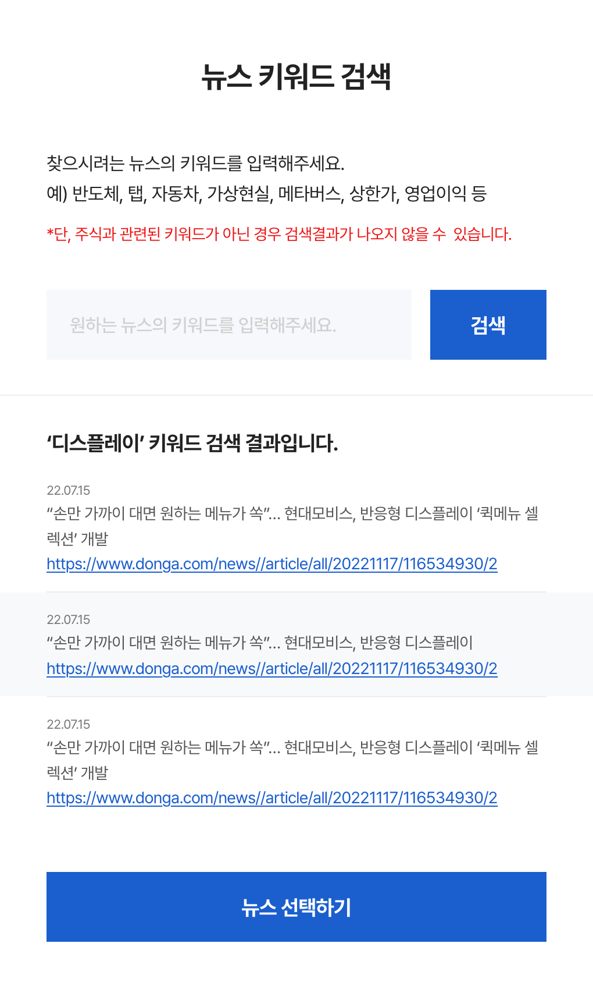
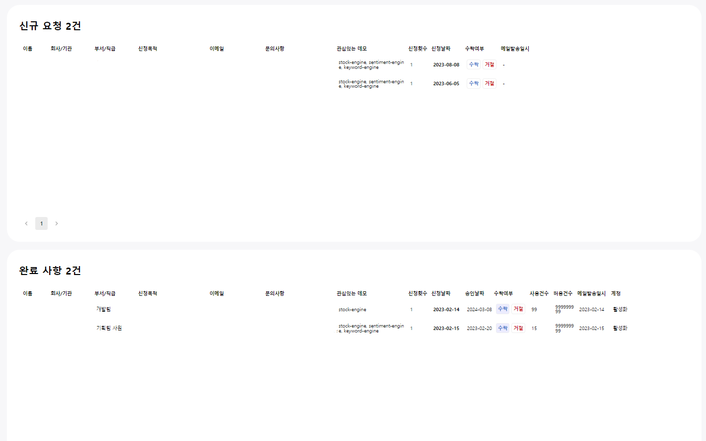
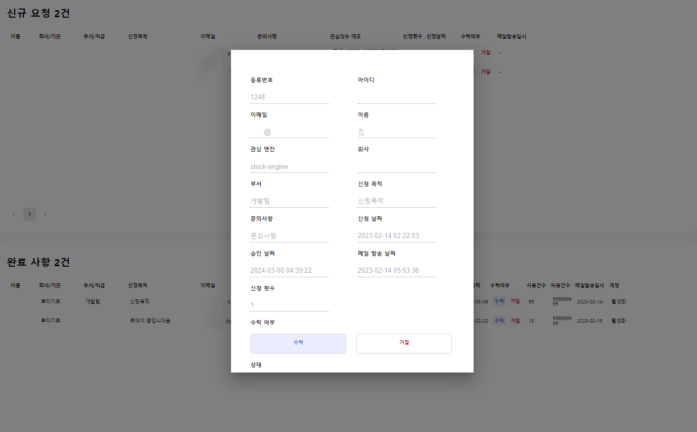

+++
author = "Sojin Shin"
title = "AI 신규 엔진 DEMO 사이트 및 어드민 페이지"
date = "2022-11-27"
description = "자사 신규 AI 모델 테스터 페이지와 신청자 관리를 위한 어드민 페이지"
tags = [
    "react",
    "javascript",
    "frontend",
]
categories = [
    "project",
]
image = "demo-thumbnail.png"
+++  

## 기술 스택
- **프론트엔드:**

## 이미지 모아보기
|            로그인            |  뉴스입력       |
|:-------------------------:|:-------------------------:|
|  | |
|            종목명 분석           | 감정 분석          |
|  | |
|            키워드 분석          |  뉴스 검색     |
|  | |
|               어드민 대시보드    | 회원정보 수정     |
|  | |

## 설명
자사의 신규 nlp 엔진의 종류와 장점을 소개하고 데모 신청을 받기 위한 페이지를 개발하였습니다.  
[여기](http://aidemo.2digit.io/)서 확인할 수 있었으나, 현재 서비스 중지된 상태입니다. 

## 기능

### 데모 페이지
- 데모 페이지 퍼블리싱
- 로그인 기능 구현
- 엔진 분석 결과값 시각화 (워드클라우드, bar차트)
- 사용 횟수 차감 및 기능 
- 뉴스 검색 기능

### 어드민 페이지
- 관리자 계정 로그인 기능
- 신청자 데모 사이트 허가 여부 기능 
- 회원 정보 (횟수, 기간, 상태 등) 수정 기능

