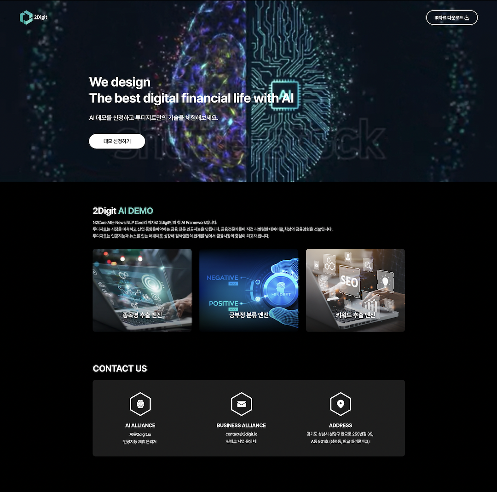
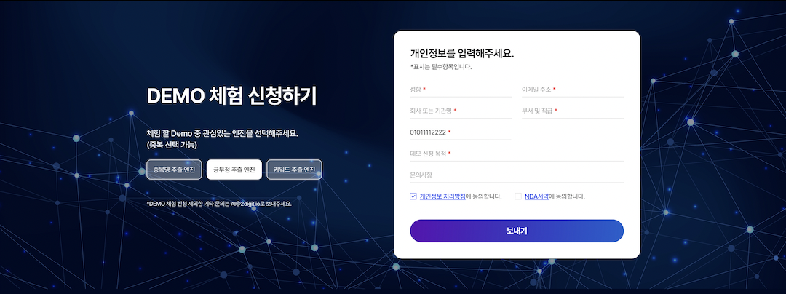

+++
author = "Sojin Shin"
title = "AI demo 랜딩 페이지 개발"
date = "2022-11-27"
description = "자사 AI 엔진 소개 및 데모 사용 신청을 위한 페이지"
tags = [
    "react",
    "javascript",
    "frontend",
]
categories = [
    "project",
]
image = "demo-thumbnail.png"
+++  

## 기술 스택
- **프론트엔드:**
  
  

  

## 이미지 모아보기
|            소개             |
|:-------------------------:|
|  |
|            신청서            |
|  |

## 설명
자사의 신규 nlp 엔진의 종류와 장점을 소개하고 데모 신청을 받기 위한 페이지를 개발하였습니다.  
[여기](http://ai.2digit.io/)를 클릭하여 프로젝트를 확인할 수 있습니다.

## 기능

• 사용자 정보 입력 폼 유효성 체크  
• PASS 본인인증 연동  
• 신청자 정보 어드민 페이지와 연동  
• 신청 현황 메일링 기능  
• 개인정보 처리방침, NDA 서약 페이지

## 어려웠던 점 / 배운점

프로젝트의 목표는 간단한 랜딩페이지를 개발하여 사용자들에게 서비스 소개 및 가입 유도를 목적으로 했습니다.  
기술 스택 선택에 있어서는 React를 사용할 것인지 고민이 있었으나, 프로젝트의 규모와 목적을 고려하여 가벼운 HTML과 VanillaJS로 개발하는 것으로 결정했습니다.

### 본인인증 연동 방식
카카오톡, 구귿 같은 경우는 key를 발급받으면 API 제공하여 기능을 이용할 수 있었습니다.  
하지만 본인인증의 경우 아래 두개의 방법을 제공하긴 하나,
- API방식
- 모듈 방식

아쉽게도 회사에서는 두번째 방식을 사용하고 있어 조금 낯설다고 느꼈습니다.

### 본인인증 후 데이터 전송
본인인증 모듈을 사용하는 과정에서 새 창을 띄워야 하는데, 이때 자식 창에서 부모 창으로 데이터를 전달해야 했습니다. 
이를 위해 window.opener.postMessage 메소드를 처음 사용해봤는데, 이해하고 적용하는 데 시간이 소요되었습니다.

또한, 본인인증 요청에 대한 성공 코드까지는 확인 지만, 이후의 데이터 처리에 대한 방법을 몰랐습니다.
자사 앱에도 같은 기능이 있어 앱개발자에게 조언을 구했습니다. 앱에서는 본인인증 후 `getInfo` 함수를 호출하여 회원정보를 받아온다고 하였습니다.   
이를 참고하여 본인인증 백엔드 담당자분에게 앱/웹을 구별할 수 있도록 수정 요청드렸고 기능을 개발할 수 있었습니다. 