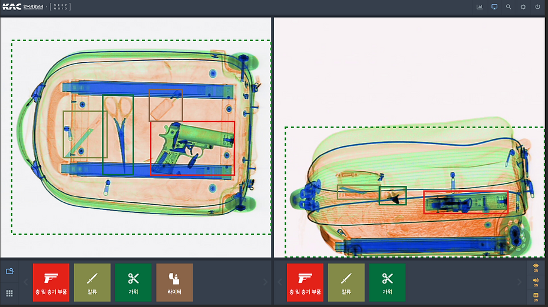

+++
author = "Sojin Shin"
title = "DEEP:SECURITY"  
date = "2021-12-21"
description = "인공지능 모델을 사용해 기존의 보안 검색 프로세스를 혁신하여 보안 사고 및 고비용 문제를 해결하고 보안검색요원이 보다 쉽고 빠르게 업무를 처리할 수 있도록 도와주는 서비스"  
tags = [
    "react",
    "javascript",
    "frontend",
] 
categories = [
    "project",
]
series = ["work experience"]
image = "deepnoid-thumbnail.png"
+++

## 기술 스택
- **프론트엔드 :**
  
  
  
  

 
## 이미지 모아보기

|            홈 - 싱글모드            |           홈 - 듀얼모드           |
|:------------------------------:|:----------------------------:|
|  |      |
|              히스토리              |             대시보드             |
|        |  |

## 설명
[여기](https://www.deepnoid.com/deep-security)서 프로젝트에 대한 자세한 소개를 볼 수 있습니다.

## 기능

### 실시간 화면 판독/알림 기능 구현
• Top View/ Side View 등 자유로운 관찰이 가능한 multi View 제공  
• 알림 세부 설정 및 판독 결과 표시 On/Off 기능  
• 대상 이미지 확대/축소, 위치 이동을 통한 상세 확인 가능    
• 물품 유형별 원하는 색상을 설정하여 신속한 확인 유도  

### 판독 이력 검색 및 열람
• Setting 기능을 통해 원하는 특정 품목에 대한 판독 설정 가능  
• Thumbnail 기능으로 Tracking된 가방 재확인 가능  
• 특정 가방과 그 안에 들어있는 보안 위해 물품에 대한 정보 확인 가능  

### 판독 데이터 조회 및 통계  

• 통계 기능을 시각화하여 탐지된 물품의 수량 확인 용이  
• 특정 날짜와 시간, 원하는 물품의 카데고리를 설정하여 세부 검색 가능  
• 특정 기간동안 탐지된 가방의 수, 위해물품의 종류 및 수 등 확인 가능  

## 어려웠던 점 / 배운점

AI가 실시간으로 x-ray 영상을 분석하고 데이터를 받아 화면에 보여주어야 하는 프로젝트에서, 
개발을 할 때에는 실시간 영상이 아닌 미리 녹화된 파일을 이용하여 기능을 구현했습니다. 
그러나 실제 서비스로 전환될 때에는 실시간 영상을 받아들이고 처리해야 하는 문제가 있었습니다.

코드는 짧은 시간동안 함수를 호출하는 방식으로 작성되어 있어서, 캔버스에 그려지는 바운딩 박스(Bbox)가 끊겨 보이는 느낌이 들었습니다. 
이러한 문제를 해결하기 위해 리액트로 리팩토링을 진행하면서, 요청을 한 번만 보내고 서버로부터 지속적으로 데이터를 받을 수 있는 소켓(socket) 방식을 채택하기로 했습니다.

이 방식을 적용하면 이동하는 화면에 맞춰 새로운 좌표값을 지속적으로 받을 수 있어, 바운딩 박스의 움직임이 이전보다 훨씬 자연스러워졌습니다. 
해당 기능을 개발하며 socket에 대한 개념을 알 수 있는 기회가 되었고, 캔버스 태그에 대한 개념도 한 층 더 이해할 수 있었습니다. 
