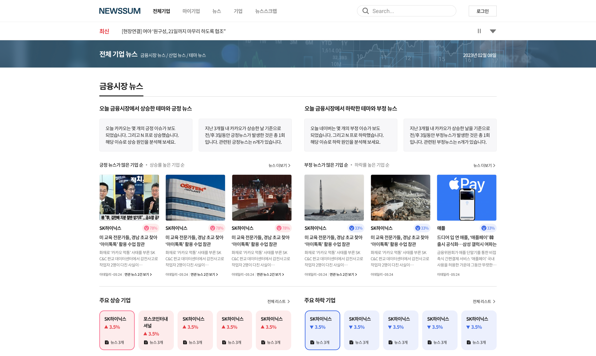
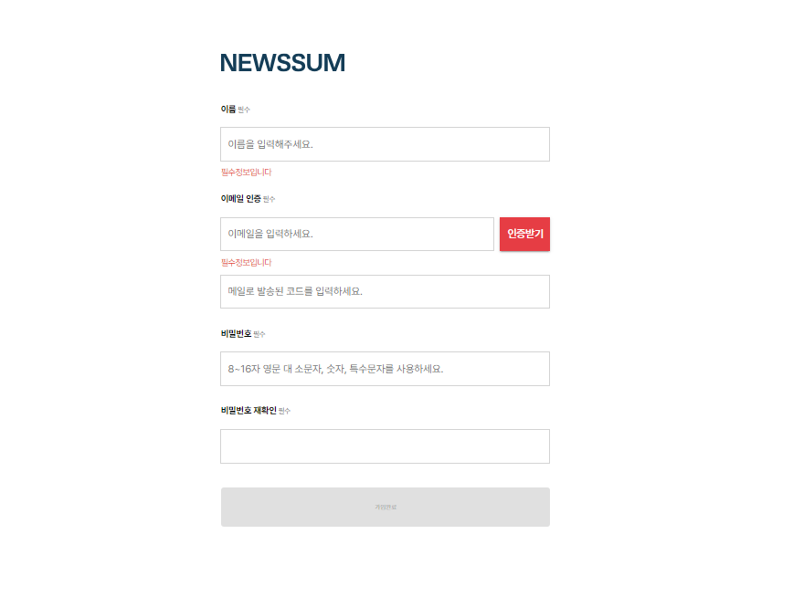
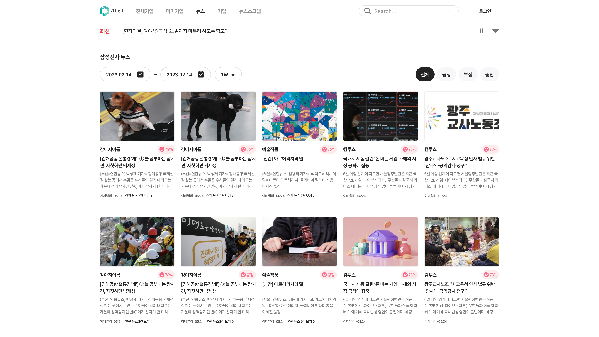
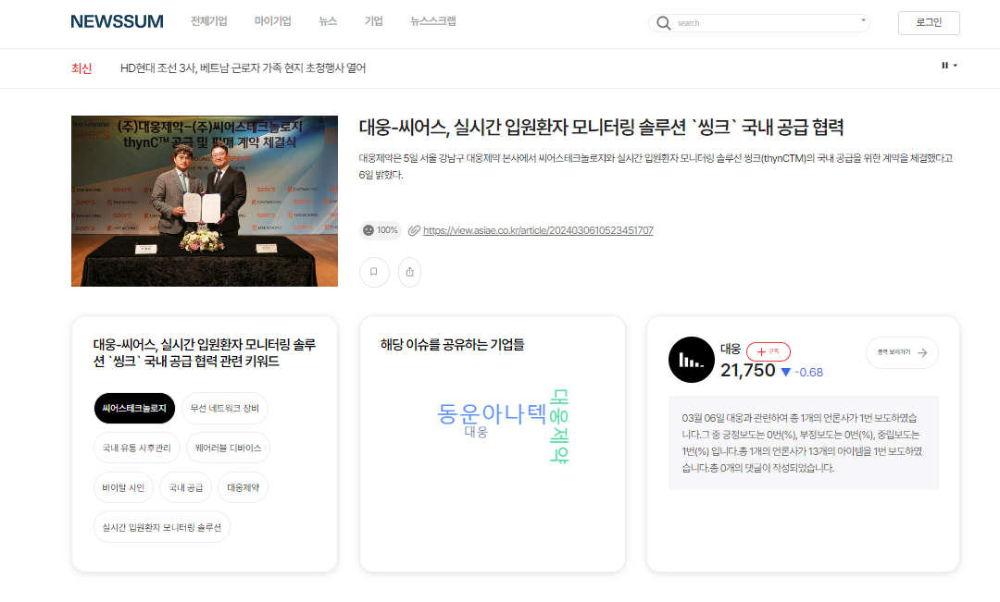
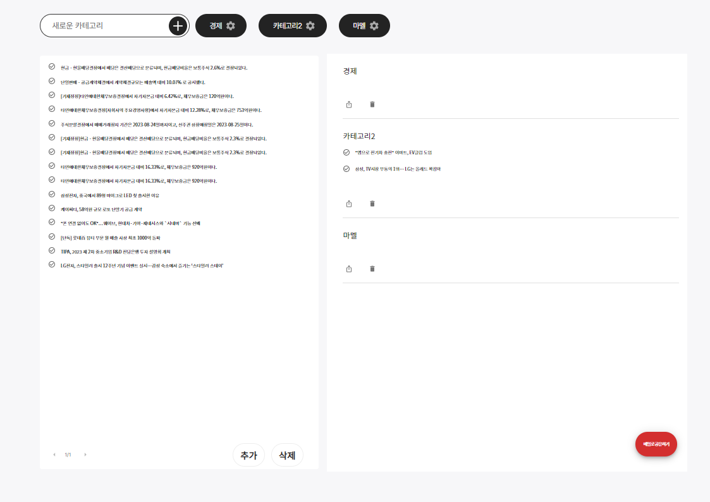
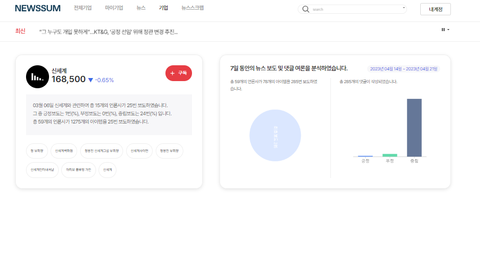

+++
author = "Sojin Shin"
title = "뉴스썸"
date = "2023-01-25"
description = "AI가 만들어주는 경제 뉴스, 뉴스썸"
categories = [
"project",
]
tags = [
"react",
"javascript",
"frontend",
]
image = "newssum_logo.png"
+++

## 기술 스택
- **프론트엔드:**
  
  
  
  

## 이미지 모아보기

|               메인화면(일부)                |                  회원가입                   |
|:-------------------------------------:|:---------------------------------------:|
|      |        |
|                 뉴스 목록                 |                  뉴스 상세                  |
|  |  |
|                  스크랩                  |                  기업 정보                  |
|     |    |

## 설명
"뉴스썸, 검색이 필요없는 초개인화 1인신문"이라는 슬로건으로 사용자가 관심있어하는 기업과 뉴스 정보를 추천받을 수 있는 서비스입니다.  
MVP 버전, 기업 과제를 거쳐 현재 뉴스썸이라는 이름으로 서비스하고 있습니다. 

[여기](https://www.newssum.co.kr/)를 클릭하여 프로젝트를 확인할 수 있습니다.

## 기능

### 회원가입/유저
- 사용자 정보 입력 폼 유효성 체크  
- PASS 본인인증 연동  
- 신청자 정보 어드민 페이지와 연동  
- 신청 현황 메일링 기능   

### 뉴스
- 경제뉴스를 금융,산업, 테마 3개로 분류하여 재카테고라징
- 당일 산업/테마 순위 및 관련 뉴스 정보 제공
- 종목(상장사)에 대한 주가 및 시황 정보 제공
- AI를 통해 개별 뉴스에 대한 종목, 키워드, 감정 분석

### 관심 등록
- 회원이 관심있어하는 기업 추가/삭제  
- 관심있는 뉴스 북마크 추가/삭제  
- 뉴스 스크랩 및 카테고리 분류 기능  
- 스크랩한 뉴스 공유 기능 (메일 발송)  
- 개별 뉴스 주소 카카오톡 및 메일 공유  

### 유지보수
- 공시뉴스 페이지 및 뉴스 조회 기능 추가
- 약관/사업자정보 변경
- 반응형 CSS 적용
- 검색엔진최적화 
- 뉴스 발행 페이지/기능 추가

## 어려웠던 점 / 배운점

첫 B2C 프로젝트를 책임지게 되면서 다양하고 일상적인 기능들을 개발할 기회를 얻게 되었습니다. 
이전까지의 경험은 B2B 프로젝트로, 주로 윈도우에 직접 솔루션을 설치하는 방식으로 진행되어 왔습니다. 
따라서 불특정 다수를 대상으로 하는 기획과 프론트엔드 코드의 배포에 대한 경험을 할 수는 없었습니다.

CRUD를 넘어선 다양한 기능들을 개발하는 경험에서 
특히 가입 시 유효성을 체크하고, 이메일 인증, SNS 공유와 같은 사용자 친화적인 기능을 구현하는 것이 흥미로웠습니다. 
또한, 원격 서버에 접속하고 프로젝트를 배포하는 과정에서는 nginx를 활용하여 웹서버를 구성하게 되었습니다. 
이를 통해 웹서버의 기능과 개념에 대해 이해할 수 있는 기회가 되었습니다.